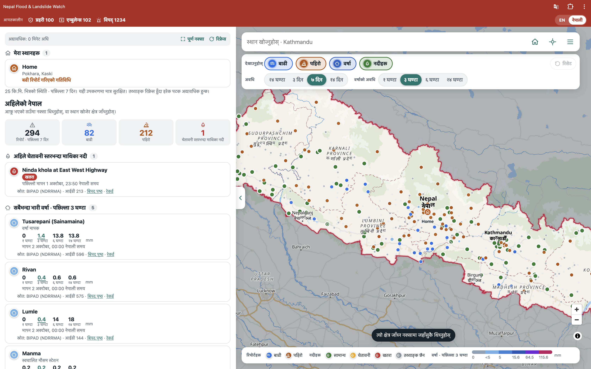

# Nepal Flood & Landslide Watch




A mobile-first, map-first web app that shows **official** flood and landslide reports and river warnings near any place in Nepal, with the source and time on everything.

It is built for people checking their own area on a weak connection, and for Nepalis abroad checking on family.

> **Not a safety guarantee.** The app summarises what official sources have *reported*. A quiet area is not confirmation that there is no hazard. It never says an area is "safe". In an emergency call Police **100**, Ambulance **102** or the Disaster hotline **1234**.

## Features

- **Map first.** Full-screen map of Nepal with the official border highlighted. Floods, landslides, river stations and rain stations are drawn as icons. Vector basemap restyled so rivers, roads and buildings read clearly.
- **Check any area.** Tap the map, search (English or Nepali), use GPS, or browse province, district, municipality. The area is highlighted and summarised as a *reported activity level* (high / elevated / some / none) with the reasons and caveats listed. The rules are shown in the app.
- **Filters.** Floods, landslides, rain, rivers; period (24 h to 14 days); rain window (1 / 3 / 6 / 24 h); radius (5 to 50 km). One-tap reset, and a button that resets the whole map to Nepal.
- **Detail drawer.** Tap any item for its details, source links and the incidents, river stations and rain within 10 km.
- **My places.** Save up to 5 places on your device (no account). Each shows its current status, updated every time data refreshes, and flags when it has risen since you last looked.
- **Trend.** Reports per day around a place for the last 14 days.
- **Rainfall.** Official observed rain (BIPAD / DHM stations) with an amount colour scale.
- **Share.** A link plus a plain-language status message for WhatsApp or SMS.
- **Works on weak networks.** Shows saved data instantly while it refreshes. Installable (PWA) and keeps the app shell, the last data and viewed map tiles offline.
- **Nepali interface** (EN / नेपाली switch). *The Nepali text needs review by a native speaker before public launch.*
- **Clearly separated extras (not official):** a 4-day model rain forecast and news headlines. They are labelled "not official" and never affect the activity level.

## Data sources

| Source | Used for | Official |
|---|---|---|
| BIPAD Portal (NDRRMA) `bipadportal.gov.np/api/v1` | incidents, river stations, rain stations, admin areas | yes |
| Survey Department of Nepal via HDX COD-AB | country and province outlines | yes |
| OpenStreetMap data via OpenFreeMap | basemap | n/a |
| Open-Meteo | rain forecast | **no** (weather model) |
| Online Khabar, Rising Nepal, Nepalnews RSS | news headlines | **no** |

Details, endpoints and quirks are in [`SOURCES.md`](SOURCES.md). Check each source's terms before a public launch. NDRRMA/BIPAD permission for regular polling is still to be requested.

## How it works

```
[worker, every 15 min] -> BIPAD API -> normalise -> Postgres + PostGIS (Supabase)
[Next.js app]          -> reads only from our database -> map, lists, API
```

Users never call government sites directly. If a fetch fails, the old data stays and the failure is recorded in `fetch_runs`.

- `worker/` Node worker (fetch, normalise, upsert, log runs).
- `db/schema.sql` tables: `incidents`, `river_stations`, `rain_stations`, `locations`, `fetch_runs`. Row-level security is on, so the public Supabase API cannot read them.
- `app/api/*` `overview` (everything the map needs), `nearby`, `locations`, `status`, `forecast`, `news`.
- `components/`, `lib/` UI, analysis rules (`lib/analysis.ts`), translations (`lib/ne.ts`), map styling (`lib/basemap.ts`).

## Getting started

Requirements: Node 22+, a Postgres database with PostGIS (a free Supabase project works).

```bash
npm install
cp .env.example .env.local     # then fill in the values
npm run migrate                # creates the tables
npm run worker -- --once       # first data load (omit --once to poll every 15 min)
npm run dev                    # http://localhost:3000
```

`.env.local` (never commit it):

| Variable | Notes |
|---|---|
| `DATABASE_URL` | Postgres connection string. With Supabase use the **Session pooler** URI (the direct host is IPv6-only). |
| `SUPABASE_URL`, `SUPABASE_ANON_KEY` | project URL and anon key |
| `SUPABASE_SERVICE_ROLE_KEY` | worker use only, never expose it to the browser |

Other scripts: `npm run build`, `npm start`, `npm run typecheck`. The offline service worker only registers in production builds.

## Project rules

- Official data only for the activity level. Never invent, guess or fill in incident data.
- Every displayed item keeps its source link and timestamp.
- Stale or missing readings show as "status unavailable", never as "normal".
- Ask before adding a dependency or changing the stack.

See [`project.md`](project.md) for the plan and decisions.

## Status and roadmap

Working: ingestion, API, map UI, My places, trend, rainfall, installable/offline, Nepali UI.

Not built yet: push alerts when a saved place's status rises (needs a server component and would store locations, so it needs an explicit privacy decision), and a "what to do" guidance panel (needs official NDRRMA wording). Also pending: review of the Nepali text, a production tile provider, hosting for the worker, and a licence.

## Credits

Map data © OpenStreetMap contributors, tiles by OpenFreeMap. Official data from BIPAD (NDRRMA), DHM and the Survey Department of Nepal (via HDX, CC BY-IGO). Forecast by Open-Meteo.
